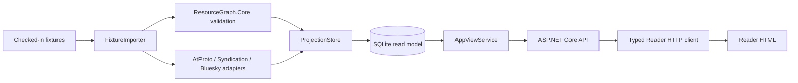

# Architecture

The sample keeps reusable protocol and graph primitives separate from
application-specific persistence and transport:

`AppViewService` implements the primitives repository's
`ResourceGraph.AppView.IResourceGraphAppView` contract. Its additional
`GetBundleResponseAsync` method maps the persisted projection to this
repository's draft transport envelope, preserving indexed timestamp, source
CID/revision, and diagnostics without altering the primitives contract.

The Reader references only the contracts assembly. It has no project reference
to the application or SQLite assembly, so the HTTP boundary is real even when
the API and Reader run on the same machine.

## SQLite read model

The schema is created by `ProjectionStore.InitializeAsync` from one
deterministic migration. `bundles` is the indexed root; `bundle_members` keeps
authored positions and references; `source_records` retains AT record identity,
CID, revision, raw value, and normalized projection; `projection_diagnostics`
preserves validation and adapter diagnostics. `ingestion_events` provides
replay idempotency and `ingestion_cursor` rejects out-of-order fixture events.

No HTTP handler calls an adapter or reads a fixture. The API only queries rows
already written by the importer/projector.
